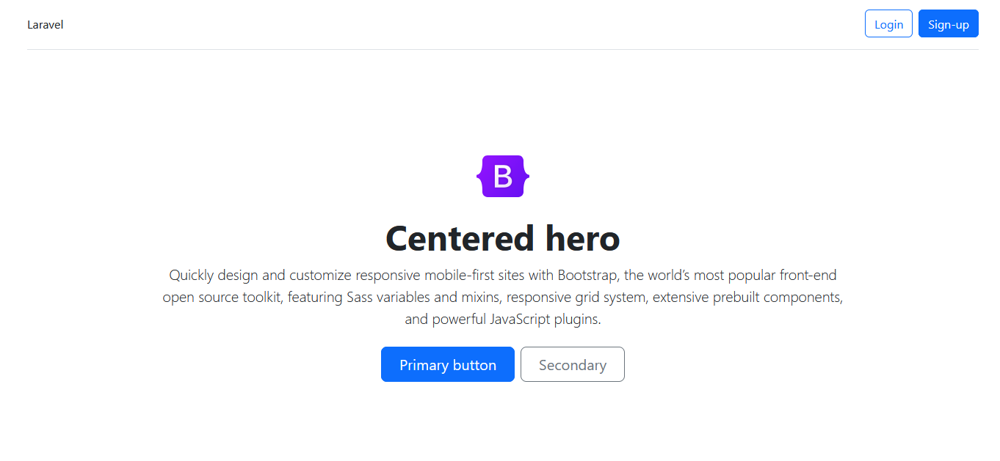
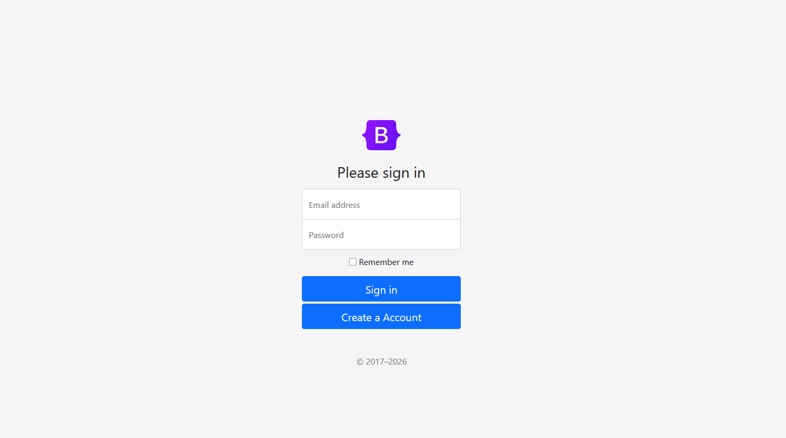
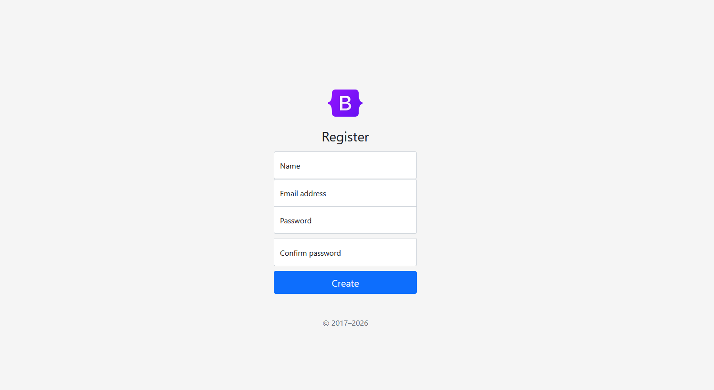

# Laravel 10 con Bootstrap 5 y livewire.

Ya tiene integrado el sistema de autenticacion laravel/ui

## Acerca de este proyecto

Esta diseñado para trabajar con bootstrap ya tiene integradeo livewire.

## How to install.

crear una carpeta en el directorio de tu preferencia ejemplo /var/www/proyecto

git clone https://github.com/angelrd06/bootstrap-login.git proyecto  
cd proyecto  
composer install  
cp .env.example .env  
php artisan key:generate  

nano .env  

DB_CONNECTION=mysql  
DB_HOST=127.0.0.1  
DB_PORT=3306  
DB_DATABASE=nombre_de_tu_db  
DB_USERNAME=usuario_de_tu_db  
DB_PASSWORD=contrasena_de_tu_db  

php artisan migrate  

**Para dependencias livewire**    
npm install  
npm run build  

## imagenes  

## License

The Laravel framework is open-sourced software licensed under the [MIT license](https://opensource.org/licenses/MIT).
